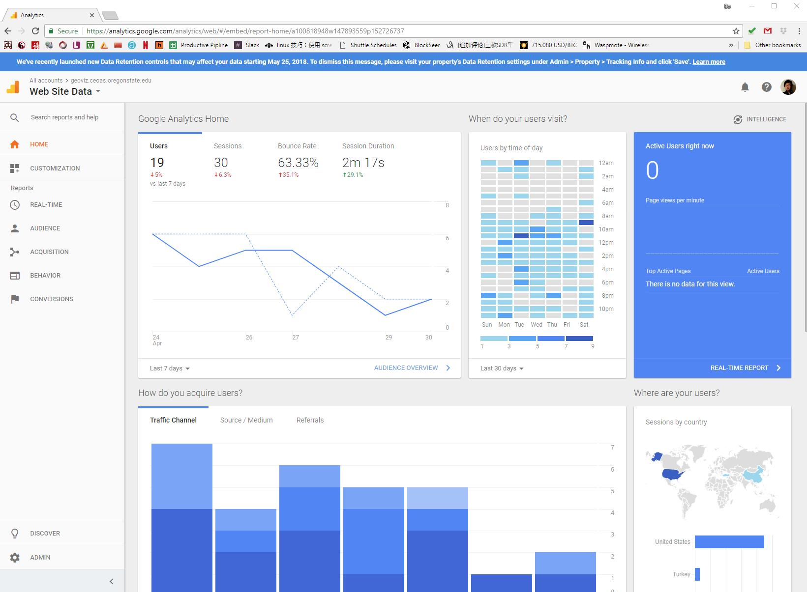
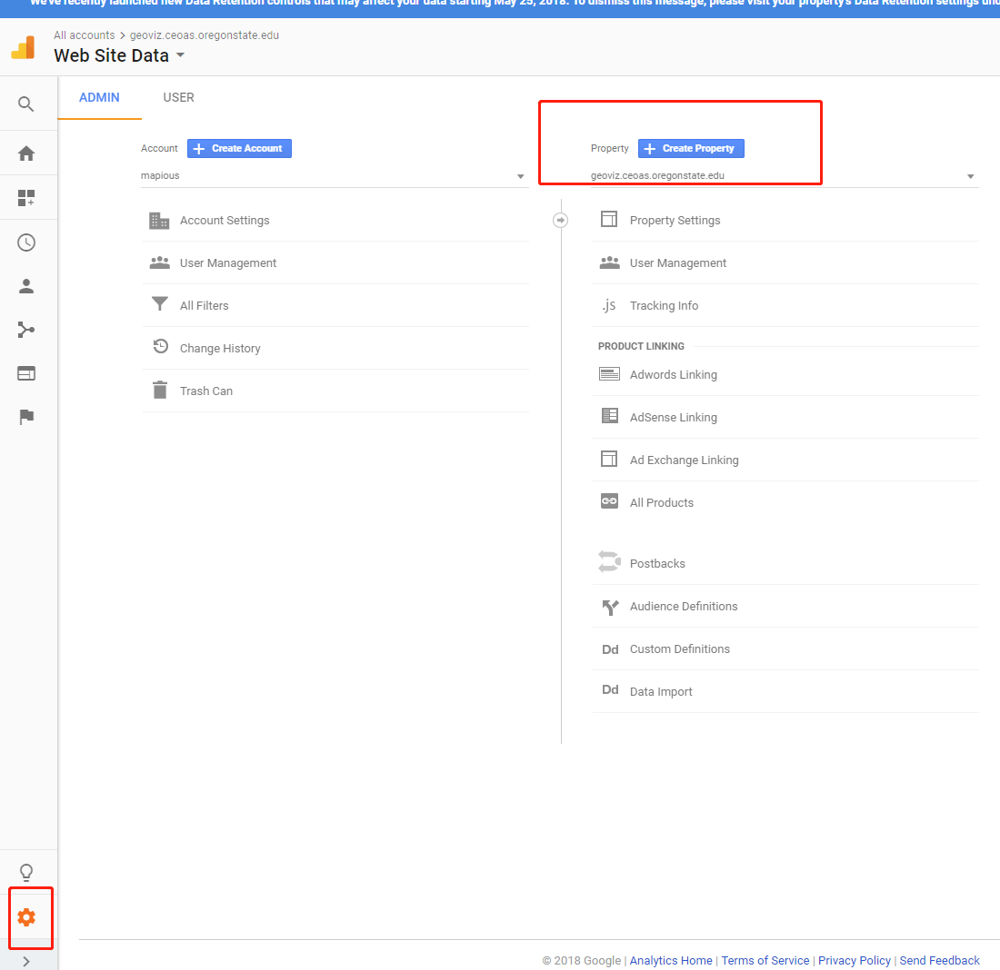
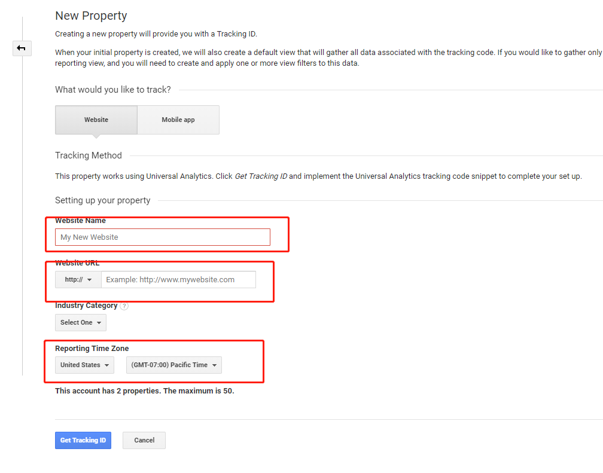

# GeoViz Evaluation

> Spring 2019 | Geography 4/572 | Geovisual Analytics
>
> **Instructor:** Bo Zhao  **Location:** Wilkinson 210 | **Time:** TR 1600 - 1650

**Learning Objectives**

- Learn how to set up a google analytics to assess your web site.

Google Analytics is a freemium web analytics service offered by Google that tracks and reports website traffic. Google launched the service in November 2005 after acquiring Urchin. Google Analytics is now the most widely used web analytics service on the Internet.

Google Analytics is implemented with "page tags", in this case, called the Google Analytics Tracking Code, which is a snippet of JavaScript code that the website owner adds to every page of the website. The tracking code runs in the client browser when the client browses the page (if JavaScript is enabled in the browser) and collects visitor data and sends it to a Google data collection server as part of a request for a web beacon.




The tracking code loads a larger JavaScript file from the Google web server and then sets variables with the user's account number. The larger file (currently known as ga.js) is typically 18 KB. The file does not usually have to be loaded, however, due to browser caching. Assuming caching is enabled in the browser, it downloads `ga.js` only once at the start of the visit. Furthermore, as all websites that implement Google Analytics with the ga.js code use the same master file from Google, a browser that has previously visited any other website running Google Analytics will already have the file cached on their machine.

## 1 Register Google Analytics

https://analytics.google.com/

## 2 Create A new Property

Click on the `admin` page at the end of the left side bar, and then click the `create property` button on the opened-up page to create a new property.



## 3 On the newly opened page, please input the website name, website url and reporting time zone. Once filled, press the button `Get Tracking ID`.



## 4 Then you will see your Tracking ID and `gtag.js`. Below is the `gtag.js` code snippet:

```javascript
<!-- Global site tag (gtag.js) - Google Analytics -->
<script async src="https://www.googletagmanager.com/gtag/js?id=UA-100818948-3"></script>
<script>
  window.dataLayer = window.dataLayer || [];
  function gtag(){dataLayer.push(arguments);}
  gtag('js', new Date());

  gtag('config', 'UA-100818948-3');
</script>
```

Copy and paste this code as the last elemennt inside `<body>` of every webpage you want to track. If you already have a Global Site Tag on your page, simply add the config line from the snippet below to your existing Global Site Tag.

[Here](view-source:jakobzhao.github.io) is an example of web page using the `gtag.js`. (Pleas scroll down to the very end of this page.)
